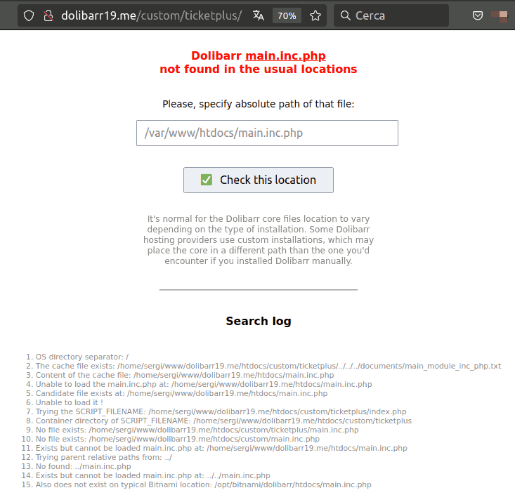

# dolibarr_load_main_inc_php - 2.0 version

- A simple PHP script to be included in third-party modules of Dolibarr to smartly detect the location of the core file `main.inc.php`.

## Why?

- Over the last few months, I've had more and more customers using Dolibarr installed through some kind of automatic installer, like the Dolibarr installation by Bitnami on AWS. It seems that these kinds of installations place the directory `/custom` OUTSIDE of `/htdocs`, so the classical/native way to find the `main.inc.php` file of the Dolibarr core is unable to locate it!
- For this reason, I have created this `main_module.inc.php` file to be included in all of my Dolibarr modules to be installed in `/custom`. This file is "smarter" because it's designed to work with other "typical" known installations as well. For example, Bitnami on AWS installs `main.inc.php` here: `/opt/bitnami/dolibarr/htdocs/main.inc.php`, while `/custom` is in `/bitnami/dolibarr/htdocs/custom` (note the `/opt` in the former).

## Caching on a physical file 

- Additionally, I've replaced the typical collection of `@include("../main.inc.php")` with a longer list of locations. Furthermore, to avoid repeating this "search" each time we call the module, I use a "cache" physical file at `/documents/main_module_inc_php.txt` or alternatively on `/custom/main_module_inc_php` (without file extension) to save the location of `main.inc.php`.
- So, in this way, on each load, we FIRST TRY the path stored in this cache file. If it doesn't work, then we perform the initial search again.
- This system is faster than the default method used and recommended by Dolibarr for third-party modules.

## Requesting user assistance

- The default include() system recommended by Dolibarr returns the message `"Include of main fails"` on a blank web page. However, this doesn't help the user fix the problem.
- Therefore, I've replaced this static message with a web form that requests the user to provide the absolute path of the file `main.inc.php`. This allows the user to easily fix it from their browser. In the successful case that the path is correct and `main.inc.php` is loaded, the path is stored in the "cache physical file" for subsequent calls to this module.
- In the version 2.0 of this script, it has been included at the bottom of that web form a SEARCH LOG detailing all the file paths used by the script and the result (found, not found, loaded, not loaded, stored, not stored). This is useful for the user having troubles to understand better what's going on, and this info can help us (the developers) to maybe fix the script and make it still smarter.
- In the 2.0 version of this script, a SEARCH LOG has been included at the bottom of the web form detailing all the file paths used by the script and the result (found, not found, loaded, not loaded, stored, not stored). This is useful for users having trouble understanding better what is going on, and this information can help us (the developers) to potentially fix the script and make it even smarter.



## How to use it

1. Place the file `main_module.inc.php` in the root of your module.
2. In all the PHP files where you're loading `main.inc.php`, replace the typical:
```
   // Try main.inc.php using relative path
   if (!$res && file_exists("../main.inc.php")) $res = @include "../main.inc.php";
   if (!$res && file_exists("../../main.inc.php")) $res = @include "../../main.inc.php";
   if (!$res && file_exists("../../../main.inc.php")) $res = @include "../../../main.inc.php";
   if (!$res) die("Include of main fails");
```
with this:
```
include_once('main_module.inc.php');
```
or, if the file is in a subdirectory, use this:
```
include_once('../main_module.inc.php');
```

# Compatibility with Windows

It has been attempted to make it 100% compatible with Windows OS. As you should know, the main difference in this area is the use of the symbol "\\" instead of "/" to separate directories in a path. The script uses the native PHP constant called DIRECTORY_SEPARATOR to separate directories in the paths. Even so, if you detect any inconsistency in your Windows installation, let us know.

In the 2.0 version has been fixed some "odd things" used by PHP in a Windwos environment. For example, when you retrieve $_SERVER['SCRIPT_FILENAME'] it returns a file path using the UNIX  directory separatorr (/) instead of the windows one (\\) !!??

# Compatibility with Dolistore

- In the first version i was not able to upload my modules to Dolistore using this script, but it was solved. It was neeed to change the name of the script: from `load_main.inc.php` to the current `main_module.inc.php`. Thanks to an Eldy suggestion of the Dolibarr core team.

# Please, help us

- I'm sharing this `main_module.inc.php` script here because we can collectively make it smarter and more adaptable for **any third-party module** to be installed in the `/custom` directory. I've designed it to be module-agnostic.
- So, if you discover how to include other known paths used by other hosting providers, please provide the details, and I will add them to the module (or you can submit a PR).
- Additionally, if you find ways to improve any part of the script, any suggestions are very welcome! 😁
