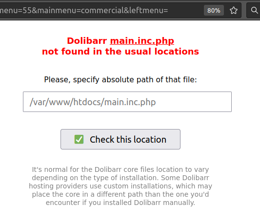

# dolibarr_load_main_inc_php

- A simple PHP script to be included in third-party modules of Dolibarr to smartly detect the location of the core file `main.inc.php`.

## Why?

- Over the last few months, I've had more and more customers using Dolibarr installed through some kind of automatic installer, like the Dolibarr installation by Bitnami on AWS. It seems that these kinds of installations place the directory `/custom` OUTSIDE of `/htdocs`, so the classical/native way to find the `main.inc.php` file of the Dolibarr core is unable to locate it!
- For this reason, I have created this `load_main.inc.php` file to be included in all of my Dolibarr modules to be installed in `/custom`. This file is "smarter" because it's designed to work with other "typical" known installations as well. For example, Bitnami on AWS installs `main.inc.php` here: `/opt/bitnami/dolibarr/htdocs/main.inc.php`, while `/custom` is in `/bitnami/dolibarr/htdocs/custom` (note the `/opt` in the former).

## Caching on a physical file 

- Additionally, I've replaced the typical collection of `@include("../main.inc.php")` with a longer list of locations. Furthermore, to avoid repeating this "search" each time we call the module, I use a "cache" physical file at `/custom/load_main_inc_php` to save the location of `main.inc.php`.
- So, in this way, on each load, we FIRST TRY the path stored in this cache file. If it doesn't work, then we perform the initial search again.
- This system is significantly faster than the default method used and recommended by Dolibarr for third-party modules.

## Requesting user assistance

- The default include system recommended by Dolibarr returns the message `"Include of main fails"` on a blank web page. However, this doesn't help the user fix the problem.
- Therefore, I've replaced this static message with a web form that requests the user to provide the absolute path of the file `main.inc.php`. This allows the user to easily fix it from their browser. In the successful case that the path is correct and `main.inc.php` is loaded, the path is stored in the "cache physical file" for subsequent calls to this module.



## How to use it

1. Place the file `load_main.inc.php` in the root of your module.
2. In all the PHP files where you're loading `main.inc.php`, replace the typical:
```
   // Try main.inc.php using relative path
   if (!$res && file_exists("../main.inc.php")) $res = @include "../main.inc.php";
   if (!$res && file_exists("../../main.inc.php")) $res = @include "../../main.inc.php";
   if (!$res && file_exists("../../../main.inc.php")) $res = @include "../../../main.inc.php";
   if (!$res) die("Include of main fails");
```
with this:
```
include_once('load_main.inc.php');
```
or, if the file is in a subdirectory, use this:
```
include_once('../load_main.inc.php');
```

# Please, help us

- I'm sharing this `load_main.inc.php` script here because we can collectively make it smarter and more adaptable for **any third-party module** to be installed in the `/custom` directory. I've designed it to be module-agnostic.
- So, if you discover how to include other known paths used by other hosting providers, please provide the details, and I will add them to the module (or you can submit a PR).
- Additionally, if you find ways to improve any part of the script, any suggestions are very welcome! 😁
